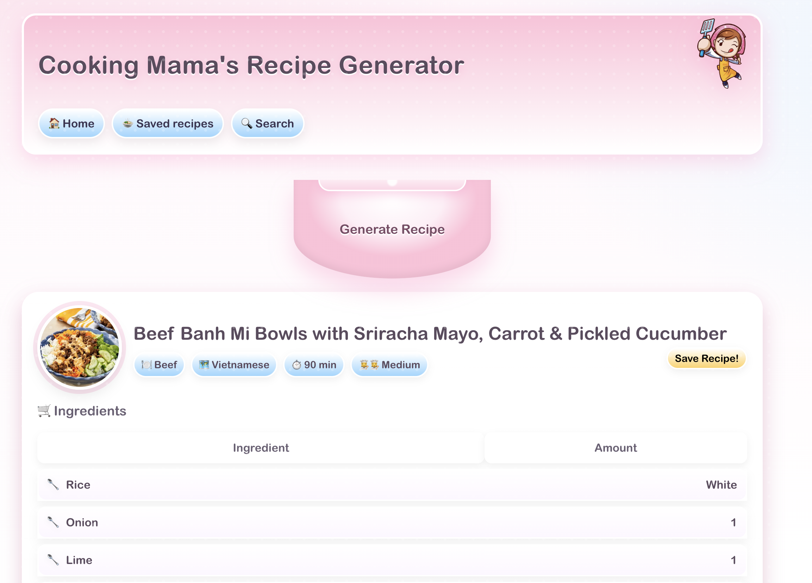

# Cooking Mama Recipe Generator

Fun, fast recipe explorer inspired by Cooking Mama. Built with React + Vite and powered by TheMealDB public API. Generate a random meal, browse by category or area, save favorites locally, and share links. Ships as a lightweight PWA with offline caching.

## Demo

Images live in `images/` so they render correctly on GitHub and in docs.

## Features

- Random recipe generator: one tap for a new idea
- Browse and search by category or area
- Save favorites to LocalStorage; quick remove and search
- Shareable links for saved/single recipes
- PWA: installable, offline fallback, and cached assets
- Robust loading, empty, and error states

## Tech Stack

- React 18, React Router
- Vite (dev server and build)
- TheMealDB API (no key required)
- ESLint for linting

## Backend

The backend for this project lives here:
https://github.com/manursutil/random-recipe-generator-backend

## Quick Start

- Requirements: Node.js 18+
- Install deps: `npm install` (or `pnpm i` / `yarn`)
- Dev server: `npm run dev` then open the printed URL
- Production build: `npm run build` (outputs to `dist/`)
- Preview build: `npm run preview`

## How It Works

- Data: `src/api/api.js` calls TheMealDB for random meals, lookup by id, categories, and areas.
- Routing: See `src/App.jsx` for routes: `/` (random), `/my-recipes`, `/my-recipes/:id`, `/search`, `/search/:id`.
- State: Saved recipes persist to `localStorage` (no backend required).
- PWA: `public/sw.js` handles cache-first for static assets; registered in `src/main.jsx`. Manifest at `public/manifest.json`.

## Project Scripts

- `npm run dev`: Start Vite dev server
- `npm run build`: Create production build
- `npm run preview`: Preview the production build

## Folder Overview

- `src/components/`: UI components (Recipe, Saved, SingleRecipe, Search, etc.)
- `src/api/api.js`: API helpers for TheMealDB
- `public/`: PWA assets and service worker
- `images/`: Demo screenshots used in this README

## Acknowledgements

- Recipes and data from TheMealDB (www.themealdb.com)

## Roadmap

- [x] Randomizer, search, and saved lists
- [x] Shareable links and robust states
- [x] PWA support + offline caching
- [x] Screenshots and usage docs
- [ ] User accounts with server persistence
- [x] Advanced filters and tags
